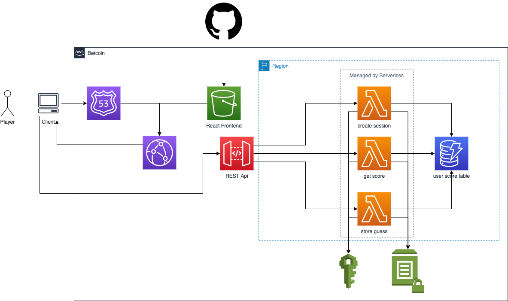
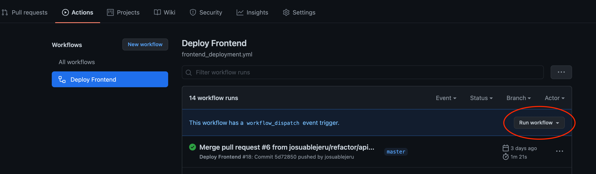

# Betcoin

[](https://github.com/josuablejeru/betcoin/actions/workflows/frontend_deployment.yml)

## Basic Functionality

Betcoin is an app that allows the User to make a bet based on the current BTC/USD price.
A User can place a Bet for the current Bitcoin price that will go up or down.
Based on his Bet he will get or lose a Point.

You can see a working example [here](https://betcoin-app.xyz).

## Architecture



## Tools, Languages and Frameworks used

This App was built on AWS using:

- Next.js
- Typescript
- Terraform
- Serverless Framework
- Python
- OpenApi3
- Github Actions

\*Bitcoin price is provided by coinbase.

## 🚀 Deployment

### ⚙️ Prerequisites

To deploy the App, one should have an Account on AWS and Github.
A domain with access to the provider would be also helpful, but is not mandatory.
Also one will need a personal access token from github to deploy the frontend with the Github Action
(use [this](https://docs.github.com/en/github/authenticating-to-github/creating-a-personal-access-token) doc).

The installation of Terraform and serverless CLI is required.

### 🚶‍♂️ Installation Steps

- Go to `/aws/lambdas/betcoin` and run `$ npm install`.
  After that you should run `$ npm deploy:dev` or `$ npm deploy:prod` depending on which stage you want to deploy.

- In the AWS console you should create manually a Hosted Zone, where you put your `NS` or other types of records for your domain.

- Include a `secrets.tfvars` file with the following properties in `aws/`

  ```terraform
    domain_name           = "<your-custom-domain>"
    aws_access_key_id     = "<aws-access-key-id>"
    aws_secret_access_key = "<aws-secret-access-key>"
    github_token          = "<your-github-token>"
    github_owner          = "<your-github-username-there-the-repository-exists>"
  ```

- Change the Terraform state backend in `providers.tf` if needed (by default the Terraform state will be created locally on your machine)
- Run `$ terraform init` in `aws/`
- Create a new Terraform workspace using `$ terraform workspace new <name>` preferable `dev` or `prod`
- The application should be deployed using `$ terraform apply` in `aws/`
- To deploy the Frontend you could do it either with the AWS CLI by running `$ yarn build` in `frontend/betcoin/` or manually with Github
  Action `Deploy Frontend`, where you can trigger the deployment manually
  

- Start the game!

## 👻 Feature Improvements

I would improve the user session with AWS Cognito so a new User could register with his social accounts or create a new account using his email.

## 🤔 Another Solution

Another approach for this problem could be AWS Amplify in combination with Graphql.
AWS Amplify would manage the deployment, the data modeling and all the other services through Appsync.
This service could be deployed and managed by the `amplify CLI`.
